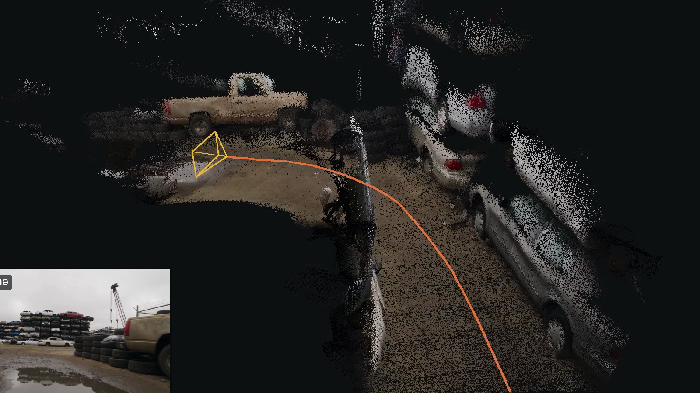

# World Sandbox

Experiments with world models and 3D reconstruction, each with an engineering journal that shows what
every stage produced. Journals: **[rozgo.github.io/world-sandbox](https://rozgo.github.io/world-sandbox/)**.

## Synthetic SLAM

Six seconds of generated video, from a small robot rolling through a junkyard, become a camera path and a
3.33 million-point map in 19.9 s on one RTX 4090. AMB3R-SLAM runs unmodified from a pinned submodule; a
tracer keeps every stage's intermediate results, and a three.js viewer replays them in 3D.

[](https://rozgo.github.io/world-sandbox/synthetic_slam/)

**[Read the journal](https://rozgo.github.io/world-sandbox/synthetic_slam/)** ·
[Open the 3D viewer](https://rozgo.github.io/world-sandbox/synthetic_slam/viewer/) ·
[Run & technical details](docs/synthetic_slam/README.md)

## Run locally

Install [uv](https://docs.astral.sh/uv/getting-started/installation/), then from the repository root:

```sh
git submodule update --init
uv sync --locked                       # figures, films and journals (macOS or Linux, no GPU)
uv run --locked python scripts/build_journals.py
python3 -m http.server 8792 --bind 127.0.0.1 --directory build/journals
```

Running SLAM itself needs Linux with an NVIDIA GPU: `scripts/setup_slam.sh`, then `slam-trace`; see
the [run guide](docs/synthetic_slam/README.md).

## Layout

| Path | Contents |
| --- | --- |
| `src/world_sandbox/` | reproducible code: the SLAM tracer, renderer and figure builder |
| `third_party/amb3r-slam/` | AMB3R-SLAM, pinned and unmodified (git submodule) |
| `scripts/` | video generation, SLAM setup, journal build and publishing |
| `docs/<project>/` | briefs, prompts, run guides and recorded results (JSON) |
| `previews/<project>/` | the images, films and viewer data the journals are built from |
| `site/` | journal sources and the 3D viewer |

[Working rules (AGENTS.md)](AGENTS.md) · [Journal format](site/journals/README.md)
